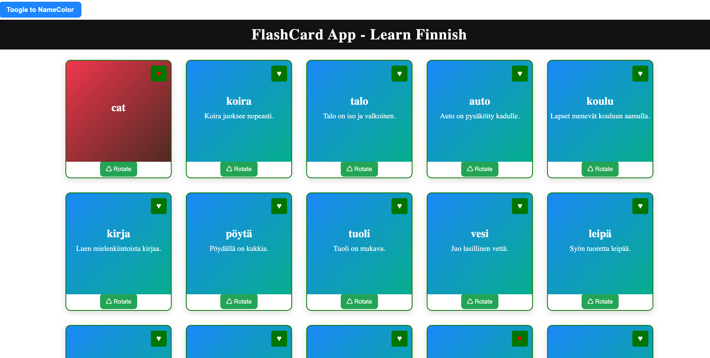

# Flashcard & NameColor App

This project is a combined **Flashcard app** and **NameColor app** built with React for the frontend and Laravel for the backend. Users can toggle between the NameColor app and the Flashcard app seamlessly.

## Features

### Flashcard App

-   Displays **Finnish words**, **English translations**, and **example sentences**.
-   Click a card to **rotate** it and reveal the English translation.
-   **Add favorite words** with a favorite button.
-   Favorites are stored in the backend in the `favourite_words` database.
-   Uses mock data from the `words` database (simulating the [FinFast.fi](https://finfast.fi) API).
    > Since the official FinFast API was not accessible, a custom API was created in Laravel to provide word data.

### NameColor App

-   Displays names with dynamic colors.
-   Can **toggle** between NameColor app and Flashcard app using a toggle button.

## Backend

-   Built with **Laravel**.
-   Provides endpoints for:
    -   Fetching word data (mocking FinFast API)
    -   Storing favorite words in `favourite_words` database
    -   Getting Favourite words from `favourite_words` database

## Frontend

-   Built with **React via inertia.js**
-   Handles:
    -   Card rotation to reveal English translation
    -   Favorite functionality
    -   Toggle between apps

## Database

-   `words` — stores Finnish words, English translations, and examples (mock API)
-   `favourite_words` — stores user favorite words

## Usage

1. Start the Laravel backend API.
2. Start the React frontend.
3. Toggle between **NameColor** and **Flashcard** app.
4. Click on a flashcard to view the English translation.
5. Click the favorite button to save words to the backend.

## Tech Stack

-   Frontend: React (via inertia)
-   Backend: Laravel
-   Database: MySQL

## Demo

### Video

  
_If It supports The video will run:_

<video width="600" controls>
  <source src="public/images_video/Working_of_FlashCardAPP.mp4)" type="video/mp4">
  Your browser does not support the video tag.
</video>

### Screenshot

